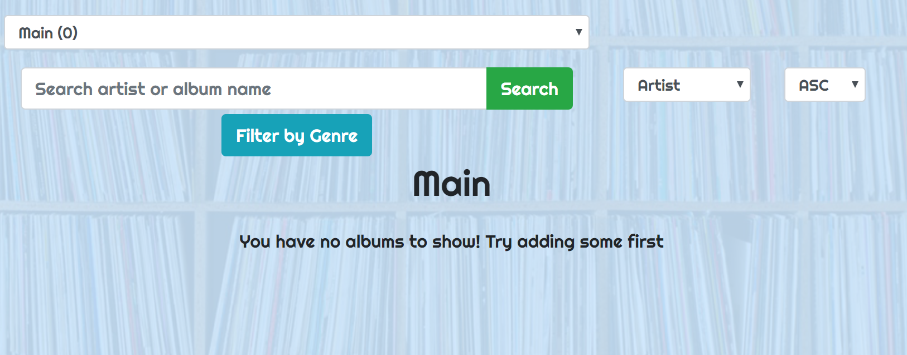

# DiscDig

## Description
A full stack application designed to allow the user to search through Discogs vinyl record database and add albums to their own personal collection. From there they can search thru their own collection, place certain albums in subcollections and discover data about their collection.

## Screenshots

#### Landing Page

When unauthorized, the user lands here. Allowing them to either login with their email and password or create a new account. If they forget their password they can click the 'Forgot Password?' button and a modal will open allowing them to enter their email address for a form to be sent to them from firebase to reset their password.

#### New User

When 'Create An Account' is pressed on the Landing Page they get taken to this New User Page. Here they input their first name, last name, email and password they want for their account. They also have an option of avatars to choose from.

#### Home Page

Once their account is created, they are taken to their home page.  When first created the home colleciton is the only collection available and it will show no albums but instead prompt them to add some to their collection. 

Once they add albums to their collection they will appear in their 'Main' collection first. Here they can search through them, sort them, delete them, and add them to a subcollection.

#### Genre Search

The user has the ability to search with a term, either the artist or album name. Using a regular expression, the results will be anything that has what the user searched anywhere in the name. They can also filter their search through genres. The genre filter buttons also show in real time how many results would show if they clicked the button.

#### Sort By

The user has the ability to sort their collection by artist name, album name and year. They can choose whether to sort any of those ways, ascending or descending.

#### Pagination

If the user has more than 10 albums in their collection then a pagination will appear above and below their collection, allowing them to go to whichever page they wish. The pagination also appears on the Add Album Page.

#### Send to Subcollection / Delete from collection

The user is able to select any of the albums in their collection. They then can Delete the album from whichever collection they are in. If they delete from a subcollection, the album will delete ONLY from the subcollection. If they delete from their Main collection then it will delete the album from the Main as well as all subcollections it might have been in.

This area also allows the user to add the selected albums to whichever subcollection is selected in the dropdown input.

#### Subcollection Page

The user can manage their subcollections on this page.

#### Add New Subcollection

They can add a new subcollection simply by inputting a name.

#### Edit / Delete Subcollection

Once the subcollection is created they can change it's name or delete it completely.

#### Album Page

The user is able to click any of the album titles in their collection and it will take them to an individual Album Page that shows more in depth detail about the album. This includes track listing, artists, credits, companies associated with it and album images.

#### Album Images

By clicking the 'Show More Images' button the user is shown a modal with a Carousel of images related to the album.

#### Add Album Page

On this page the user can search by artist, album name, or both and add whichever selected album to their main collection.

#### Search By Just Artist

If the user searches by artist only, a list of potential artists will appear allowing the user to select which artist they meant which will then show a list of that artists albums.

#### Add To Collection Check

Once the user selects an album a modal will show confirming their choice and prompting the user to check to make sure it is in fact the correct album.

#### User Profile Page

The user also has their own profile page. Here the user can edit their name, avatar, email, password or delete their account entirely. They can also get some insight into their collection with data on their favorite genre, favorite artist, and favorite decade of music.

## Created By Greg Stephen

This project was bootstrapped with [Create React App](https://github.com/facebook/create-react-app).

## Available Scripts

In the project directory, you can run:

### `npm start`

Runs the app in the development mode. 
Open [http://localhost:3000](http://localhost:3000) to view it in the browser.

The page will reload if you make edits. 
You will also see any lint errors in the console.

### `npm test`

Launches the test runner in the interactive watch mode. 
See the section about [running tests](https://facebook.github.io/create-react-app/docs/running-tests) for more information.

### `npm run build`

Builds the app for production to the `build` folder. 
It correctly bundles React in production mode and optimizes the build for the best performance.

The build is minified and the filenames include the hashes. 
Your app is ready to be deployed!

See the section about [deployment](https://facebook.github.io/create-react-app/docs/deployment) for more information.

### `npm run eject`

**Note: this is a one-way operation. Once you `eject`, you can’t go back!**

If you aren’t satisfied with the build tool and configuration choices, you can `eject` at any time. This command will remove the single build dependency from your project.

Instead, it will copy all the configuration files and the transitive dependencies (Webpack, Babel, ESLint, etc) right into your project so you have full control over them. All of the commands except `eject` will still work, but they will point to the copied scripts so you can tweak them. At this point you’re on your own.

You don’t have to ever use `eject`. The curated feature set is suitable for small and middle deployments, and you shouldn’t feel obligated to use this feature. However we understand that this tool wouldn’t be useful if you couldn’t customize it when you are ready for it.

## Learn More

You can learn more in the [Create React App documentation](https://facebook.github.io/create-react-app/docs/getting-started).

To learn React, check out the [React documentation](https://reactjs.org/).

### Code Splitting

This section has moved here: https://facebook.github.io/create-react-app/docs/code-splitting

### Analyzing the Bundle Size

This section has moved here: https://facebook.github.io/create-react-app/docs/analyzing-the-bundle-size

### Making a Progressive Web App

This section has moved here: https://facebook.github.io/create-react-app/docs/making-a-progressive-web-app

### Advanced Configuration

This section has moved here: https://facebook.github.io/create-react-app/docs/advanced-configuration

### Deployment

This section has moved here: https://facebook.github.io/create-react-app/docs/deployment

### `npm run build` fails to minify

This section has moved here: https://facebook.github.io/create-react-app/docs/troubleshooting#npm-run-build-fails-to-minify
